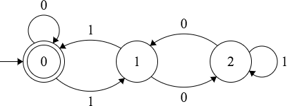
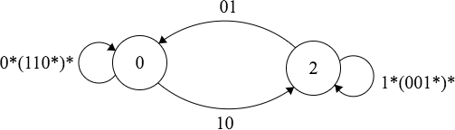

#Finite State Machines

An introduction to finite state machines (FSM).

FSM and grammars are two equivalent ways of representing a set of strings accepted by a given language.

An FSM is composed of states and transition functions.

The union of deterministic finite machines (DFM) and nondeterministic finite machines (NFM) make the set of all FSM. FSMs are a subset of turning machines and can not be used to represent all languages turning machines can represent.

All Nondeterministic finite machines can be converted to deterministic finite machines. Given a NFM create a DFM in which each state represents a set of possible states the NFM could be in, for the corresponding state transition.

DFMs are closed under compliment meaning given a machine that accepts all members of the set S, another DFM exists that does not accept any memebers of S and can be constructed from the frist DFM by converting all final states to non-final states and all non-final states to final states.

## Deterministic Finite Machine

The following is an example of a determinsitic finite machine that accepts strings in the alphabet {0,1} that are divisible by 3:

The DFM contains a starting state indicated by the arrow with no label. The starting state indicates what state to start in when testing a string's acceptance by the machine.
Every state has transitions to states for each element in the alphabet.
The is a final state, denoted by state with two concentric circles, will be the destination of the last transition of a string that is accepted by the machine.

The DFM is deterministic because there is not a state that transitions to two different states given the same member of the alphabet. However recall any DFM can be converted into a NFM and the reverse.
In order for a string to be accepted by this machine there must be exactly one set of transitions such that the last transition is to the final state.

DFMs are closed under compliment meaning to derive a machine that does not accept binary strings divisible by 3, one could make every final state a non-final state and all non-final states final.

## Nondeterministic Finite Machine

##Regex
All FSM can be represented as a regular expression.

The following digram shows a DFM accepts all binary strings that are divisible by 3.
Then it converts the DFM into a regular expression by systematically eliminating states.

