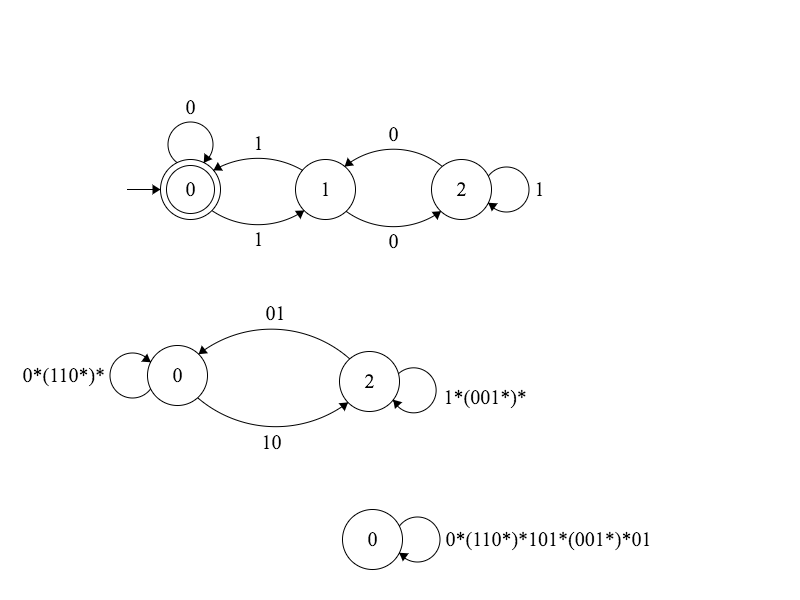

#Finite State Machines

An introduction to finite state machines (FSM).

FSM and grammars are two equivalent ways of representing a set of strings accepted by a given language.

An FSM is composed of states and transition functions.

The union of deterministic finite machines (DFM) and nondeterministic finite machines (NFM) make the set of all FSM. FSMs are a subset of turning machines and can not be used to represent all languages turning machines can represent.

All Nondeterministic finite machines can be converted to deterministic finite machines. Given a NFM create a DFM in which each state represents a set of possible states the NFM could be in, for the corresponding state transition.

DFMs are closed under compliment meaning given a machine that accepts all members of the set S, another DFM exists that does not accept any memebers of S and can be constructed from the frist DFM by converting all final states to non-final states and all non-final states to final states.

## Deterministic Finite Machine

## Nondeterministic Finite Machine

##Regex
All FSM can be represented as a regular expression.

The following digram shows a DFM accepts all binary strings that are divisible by 3.
Then it converts the DFM into a regular expression by systematically eliminating states.

